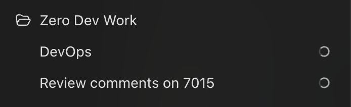
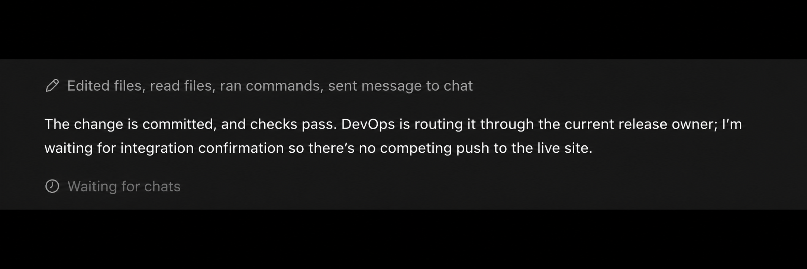
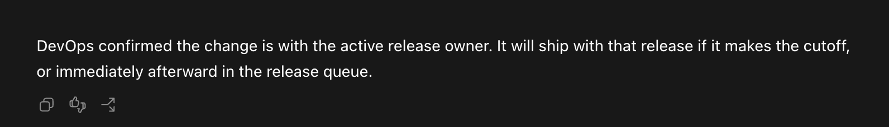

# Control Tower

**An air traffic controller for your AI coding sessions.**

Coordinate work across chats, keep changes recoverable, and release in the right order.

Several AI coding chats can each be making progress without knowing what the others are doing. Control Tower gives your project one place to connect that work: who owns what, which changes depend on each other, and whose turn it is to release.

Keep building in your working chats. Check in with the Control Tower chat for the overall picture. Where your tools support it and you authorize it, the coordinator talks directly with the other sessions; otherwise, it prepares handoffs you can pass along.

[Quick start](#quick-start) · [Setup by app](SETUP.md) · [Examples](#examples) · [Feedback](CONTRIBUTING.md)

> **Early preview · 0.1.0-review.2.** Developed from a working Codex coordination workflow. The packaged skill is still in a local trial; full installation and adoption testing remains open. Guidance covers web, iOS, Android, and backend projects, with wider compatibility still to be evaluated.

## What it looks like

Keep a **Control Tower chat alongside your working chats in each project**. You can call it “DevOps,” as in these Codex examples.



*One place to check what is happening across the project.*



*The working chat has finished its change. Control Tower coordinates when it joins the release.*

<details>
<summary>Two more examples of updates in working chats</summary>


*The handoff is complete; deployment is still pending.*



*The change has an owner and a place in the release queue.*

</details>

These illustrative examples are adapted from the Codex workflow that informed Control Tower. They show how coordination works, not test results for this candidate.

## Quick start

Start with one project. Your coding agent can handle the setup details.

1. **Get the package.** Download and extract `control-tower-release.zip` when a release is available, or download this repository through **Code → Download ZIP**. Find the folder containing `SKILL.md` and `SETUP.md`; a GitHub source download may call it `control-tower-main`.
2. **Open your project** in Codex or Claude Code, in the desktop app or CLI. In the chat you want to coordinate the project, paste the prompt below, replacing `[folder location]` with that extracted folder's location.
3. **Check the setup report.** It should identify the loaded version, the project agreement, and which existing sessions have acknowledged it. If the coordinator cannot contact them, paste its prepared handoff into those chats.

```text
Set up Control Tower for this project using the package at [folder location].
Read its SETUP.md and handle the applicable steps. Install it for this project
if needed and verify the loaded version. Use this chat as coordinator unless
one already exists; retain the existing coordinator unless I explicitly request
a handover. Update the project's instructions and coordinate its existing chats
so they recognize the agreement. Preserve existing work, installed skills,
and publication permissions. Tell me what's ready and which sessions still
need attention.
```

Then try a real task: **“Check what our active sessions are working on and recommend the next merge order.”**

**Claude Desktop general chat or Cowork:** use the [account-upload steps](SETUP.md#claude-desktop-general-chat) first. General chat and the Code tab have different setup routes.

The [full setup guide](SETUP.md) covers desktop and CLI, new and existing projects, project-wide adoption, optional global use, and checks that the other sessions recognize the coordinator. Installing the skill alone does not bring existing chats into the agreement.

## What it helps with

- **Sessions working past each other.** Connect ownership, dependencies, and release readiness across chats.
- **Changes that need to land in order.** Coordinate an app update with its backend, or keep a later website release from overwriting an earlier fix.
- **Branches nobody remembers.** Investigate orphaned-looking branches, unfinished merges, and commits that may already have shipped, while preserving uncertain work.
- **Losing the thread.** Keep a current project record of what is saved, recoverable, approved, released, or waiting on someone.

You keep control of product direction and publication authority. Control Tower follows your existing tools and release procedures, and carries out authorized routine work without repeatedly asking for the same approval.

## Examples

These fictional examples illustrate intended behavior, not completed evaluations. Think of the coordinator as air traffic control for your coding sessions: it helps establish what is ready, what depends on something else, and whose turn it is to release, while independent work keeps moving.

### An iOS app and its backend

> “One chat has the next iOS build ready, and another has the API change it needs. Coordinate them. You can back up the work, release the compatible API change, and send build 42 to our TestFlight testers. Wait for my approval before submitting it to the App Store.”

The coordinator checks the two candidates, existing ownership, account targets, release triggers, and evidence that the API change supports the currently released app. It preserves unfinished work and tests the relevant combined behavior. If the evidence supports the authorized plan, it coordinates the API release, verifies that target, and distributes the exact app build to testers. It records the remaining store-submission boundary.

Its report might be:

> “The API change is deployed and checked against the current app. Build 42 is available to testers; it has not been submitted to the store. Both source revisions are backed up and recovery is verified. Your next decision is whether to submit build 42.”

If it cannot observe tester availability, it says so. If a command times out, it checks whether the operation succeeded before repeating it. If another release intervenes, it reconciles the new baseline before proceeding.

### A website with several changes ready to ship

> “Three chats are working on our website. The checkout fix is urgent and approved to go live. The new product page is also approved, but the homepage redesign is still an experiment. Coordinate the chats and get the approved changes out.”

The coordinator identifies who owns each change and whether any files or release steps overlap. It checks whether the checkout fix and product page depend on each other, then agrees on a release order with the authorized sessions. In this example, the fix can ship first. Before releasing the product page, it incorporates that fix into the candidate and checks the combined result. The unfinished redesign remains preserved separately, and its chat can keep working.

Its report might be:

> “The checkout fix is live and verified. The product page then shipped with that fix included, so it didn't replace the repair with older code. The homepage experiment is backed up and remains private. Both releases are complete; neither is blocking the next change.”

### Branches and commits that have become hard to untangle

> “I have branches left over from several chats, a merge that never finished, and changes I thought we'd already shipped. Figure out what belongs where. Back up anything useful, prepare the right merge order, and leave uncertain work alone.”

The coordinator checks branch history, actual released code, unfinished merges, and uncommitted work, then reconciles ownership with the available sessions. A branch that looks orphaned may still contain active work; an old commit may already have shipped through a different merge. It distinguishes those cases before proposing cleanup.

Suppose a settings-screen change depends on a data-model change that hasn't landed, while a separate fix is already in production. The coordinator prepares the data-model change first, then the settings screen, checks the combined candidate, and avoids applying the shipped fix again. It preserves the interrupted merge and establishes its owner before continuing or replacing that work. Preparation does not itself publish the result or delete branches.

Its report might be:

> “The settings screen needs the data-model change first. I've prepared and checked that combined candidate. The other fix is already live. The interrupted merge is preserved for its owner, and one branch still has unclear ownership, so I've left it intact. Useful work is backed up; nothing has been deleted or published.”

## Where it works

The setup guide covers Codex desktop and CLI, Claude Desktop's Code tab, Claude Code CLI, and general Claude chat. The local skill files are shared between desktop and CLI within each tool when they use the same environment. Their access to other sessions can differ.

Claude Desktop's Code tab also documents session inspection and messaging, so the same coordination approach can apply there. Check visibility in your actual environment; use explicit handoffs where direct messaging is unavailable. [Claude session coordination](https://code.claude.com/docs/en/desktop#work-across-sessions)

The guidance adapts to websites, mobile apps, backends, and products combining them. Those are intended use cases, not a claim that every host and release path has been tested.

## Requirements and limits

Your agent needs access to the skill and its supporting files. To operate on your project, it also needs the relevant repository and provider tools. The optional read-only Git inventory helper needs Git and Python 3.9 or newer.

Control Tower supplies instructions, not an enforced merge queue or background service. Other chats must recognize the project agreement, and the coordinator can only verify what its tools can observe. Monitoring between turns requires a separately requested host automation.

The Git helper uses cached remote refs, omits ignored artifacts, and never decides that a branch is abandoned or safe to delete. Its output is a starting point for investigation, not proof of remote recovery.

## Inside the package

- [SKILL.md](SKILL.md) — operating instructions for the coordinator.
- [SETUP.md](SETUP.md) — installation and adoption across project sessions.
- [Supporting references](references/) — conditional setup, capability limits, release contexts, and project records.
- [Git inventory helper](scripts/git_inventory.py) — a read-only starting point for inspecting branches and worktrees.

## Feedback and updates

If you try Control Tower, feedback about confusing setup, unnecessary ceremony, or a handoff that breaks down is especially useful. See [how to report an issue or suggest a change](CONTRIBUTING.md).

Releases will identify their version and changes. Updating installed files does not guarantee that an active chat reloads them; verify the version and use a fresh session when needed.

Created by [Mike Maser](https://github.com/mmaser), while learning what happens when several AI coding chats all have good intentions at once.
